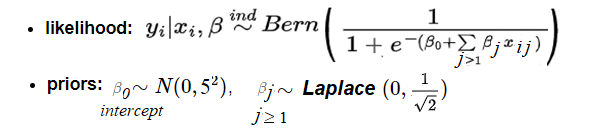
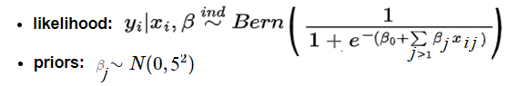

```{r setup, include=FALSE}
knitr::opts_chunk$set(echo = TRUE)
```

## Executive summary

In this article, we are going to use the `R` package `rjags` and implement Bayesian Logistic Regression, to be used to understand how diabetes is dependent on a given a set of diagnostic measurements. This appeared as a Data Analysis Project in the *Coursera* course *Bayesian Statistics: Techniques and Models*, by *University of California Santa Cruz*. 

More specifically, our objective will be:

1. Use the diagnostic measurements as predictor variables and *estimate* the coefficients for the predictors under Bayesian settings
2. *Predict* the response variable, i.e., whether a patient is *diabetic* or not, given those measurements and computed coefficients
3. Construct *Bayesian Credible Intervals* (*CI*) for the coefficients to quantify uncertainty and make probabilistic claims on the coefficients.
4. Compute the *Posterior Predictive Distribution* and use it to compute *CI* for the predictions and make probabilistic claims on the predictions for different patients. 
5. We shall use base `R` and `rjags` library functions for the implementation.

## Introduction
   Predicting whether a patient is diabetic from her medical diagnosis will be the goal of this project. Under Bayesian settings, we shall impose *priors* on the coefficients corresponding to the predictors (diagnostic measurements) and use *MCMC* sampling to compute the *posterior* distributions, verifying that the Markov chains converge to the target stationary distribution with *diagnostic tests*. We shall try to fit a few different models and use *model checking / selection* to find the best model (with *DIC*), along with that we shall use *posterior predictive distribution* to answer to a few questions (test *hypothesis*es) related to prediction of the outcomes, we shall also construct *Bayesian credible intervals* to quantify the uncertainty for the coefficient estimates and also for our prediction. As we shall see, few of the predictor variables we shall find as statistically significant.


## Data

We shall use the Diabetes dataset from Kaggle: *https://www.kaggle.com/datasets/mathchi/diabetes-data-set*. This dataset is originally from the National Institute of Diabetes and Digestive and Kidney Diseases. Several constraints were placed on the selection of these instances from a larger database. In particular, all patients here are females at least 21 years old of Pima Indian heritage. Each row corresponds to the measurements corresponding to a patient (there are *768* rows in the dataset), containing *8* **predictor** variables listed and described below (which can be used to predict the response variable), with a single **response** variable named *Outcome* (which is *1* if the patient is diabetic, *0* otherwise). 

* Pregnancies: Number of times pregnant
* Glucose: Plasma glucose concentration a 2 hours in an oral glucose tolerance test
* BloodPressure: Diastolic blood pressure (mm Hg)
* SkinThickness: Triceps skin fold thickness (mm)
* Insulin: 2-Hour serum insulin (mu U/ml)
* BMI: Body mass index (weight in kg/(height in m)^2)
* DiabetesPedigreeFunction: Diabetes pedigree function
* Age: Age (years)
* Outcome: Class variable (0 or 1)

The following table shows first few rows of the dataset.

```{r message=FALSE, warning=FALSE}
# navigate to the right path
dat = read.csv(file="diabetes.csv", header=TRUE)
dim(dat)
head(dat)
```

## Exploratory Analysis & Cleaning

* First we omit the *NA* values, if any, from the dataset.
* We observe that many of the predictors (e.g., *BloodPressure*, *SkinThickness*, *Insulin*) contain quite a few *zero* values (which appears to be impossible value for the measurements, hence),  we suspect they are noise. 
* We must remove / replace the noise / outlier values, otherwise the model fitted can be very inaccurate.
* We first compute what percentage of values for a predictor contain inappropriate *0* values and find that there are quite significant (as shown below), so we can't drop the corresponding observations, since they will reduce the data size a lot.
* Instead, we use mean imputation technique to replace the *zero* values for a predictor with the *mean* of its non-zero values, as shown below.
* Also, let's verify there is no remainign zero values in the predicor variables after imputation, so that we get clean data (only the *Outcome* column which is the response variable can contain zero values).

```{r message=FALSE, warning=FALSE}
dat = na.omit(dat)
print('percent zero values for each predictor variable columns')
100*colSums(dat == 0) / nrow(dat) # percentage zeros

vars <- colnames(dat)
col.means <- sapply(dat, function(x) mean(x[x!=0]))

for (var in vars[-length(vars)]) {
  dat[dat[,var] == 0, var] <- col.means[var]
}

print('percent zero values for each predictor variable columns after mean imputation')
100*colSums(dat == 0) / nrow(dat)  # percentage zeros after mean imputation
```

* Now, let's compute the summary of the dataset and visualize the correlation between the variables (separately for *diabetes* and *non-diabetes* observations, denoted by the colors red and blue, respectively), as shown below.

```{r message=FALSE, warning=FALSE}
summary(dat)

library(GGally)
ggpairs(dat,                 
        columns = 1:9,        
        aes(color = as.factor(Outcome),  
            alpha = 0.5))
```


* Also, let's plot the correlation between the predictors and the outcome, with darker color representing higher correlation value. 

```{r message=FALSE, warning=FALSE}
library("corrplot")
Cor = cor(dat)
corrplot(Cor, type="upper", method="ellipse", tl.pos="d")
corrplot(Cor, type="lower", method="number", col="black", 
         add=TRUE, diag=FALSE, tl.pos="n", cl.pos="n")
```


* Next let's find out whether the distributions of the predictors given *Outcome=0* and *Outcome=1* differ significantly using the following *boxplot*. Also, let's visualize the predictor distributions from the data using histograms (we can see some of the predictors in the data, e.g. *Age* are very much *right-skewed*). As can be seen from below, the distribution of the predictor variable *SkinThickness* is almost same when conditioned on different values of the *outcome*, so it's likely not to be a good predictor.

```{r message=FALSE, warning=FALSE}
par(mfrow = c(3, 3))
for (var in vars[-length(vars)]) {
  boxplot(dat[,var]~dat$Outcome, ylab=var, xlab='outcome (diabetic?)')
}
par(mfrow = c(1, 1))

par(mfrow = c(3, 3))
for (var in vars) {
  hist(dat[,var], xlab=var, main='', probability=TRUE)
}
par(mfrow = c(1, 1))
```

## Model

* We shall first fit the *glm* (generalized linear model) in `R` with `family=binomial`, with `Outcome` as the *response* and the rest of the variables as predictors. Plot the residuals (diagnostic plot) to see if there is any pattern and whether the model assumptions are met. Note the values of the  coefficients computed, the statistically significant ones. Finally, predict using the model fitted and compute the prediction *accuracy* along with the *confusion matrix*.


* Then, we shall use `rjags` to fit Bayesian models. Let's first *z-score normalize* (*scale*) the predictors and verify that each of them have mean *zero* and *unit* standard deviation.

```{r message=FALSE, warning=FALSE}
X = scale(dat[,-length(vars)], center=TRUE, scale=TRUE)
print('means (rounded to 3 decimals)')
round(colMeans(X), 3)
print('standard deviations')
apply(X, 2, sd)
X <- as.data.frame(X)
X$Outcome <- dat$Outcome
```

* First, let's fit the following model with *Bernoulli* likelihood with *logit link* function and Gaussian prior (with *zero* mean, sd *5*) on the intercept, along with *Laplace* (double exponential) prior (with zero mean and unit variance) on the remaining coefficients, to find posterior with sparse coefficients. 


* We shall use *3* independent Markov chains for mixing, reject the first *1000* samples from the *burn-in* period and simulate for another *5000* iterations, use *trace plot* to check the convergence (autocorrelation) as diagnostic. 

* Also, in order to examine convergence of the *Markov chains* to *stationary* (target posterior) distribution, we shall use the *Gelman-Brooks-Rubin* diagnostic to verify if the Markov chains don't differ much / end in the same state-space after convergence (also check the  effective sample size). 

* We shall use the *Deviance information criterion* (*DIC*) for model selection (the lower the value, the better the model fit) and to compute the effective parameter size of the problem.

* We shall see that the posterior distribution of a few coefficients includes zero, so they are likely to be less important as predictors, we shall get rid of them and refit the model, this time with Gaussian prior on all the coefficients.



* Finally, we shall fit a third model using all the eight predictors and placing *flat normal* priors on them. We shall compare the models using *DIC* and select the best model.

* We shall compute the posterior mean of the *MCMC* samples (combined) to compute the estimate of the coefficients, also compute the *95%* *Highest Posterior Density* (*HPD*) credible intervals for the coefficients.

* We shal use the posterior estimates for the coefficients for prediction of the observations and compute the accuracy of prediction.

* Finally, we shall use the *posterior predictive distribution* to predict the probability of diabetes of couple of new patients, construct *95%* Bayesian credible intervals (*CI*) and compute the probability that one patient will have more chance to be diabetic over the other.

## Results

### Logistic Regression with GLM 

As can be seen from the following results,

* The predictors `Pregnancies`, `Glucose`, `BMI`, `DiabetesPedigreeFunction` and `BloodPressure` are statistically significant (with *p-value* < 0.05, the null hypothesis can be rejected at 95% level of significance).
* The residual plot looks okay and does not show any pattern.
* Interpretation of the coefficients: e.g., increase in `Glucose` by *1* unit increases the *log odds* for diabetes by 0.0372466, whereas decrease in `BloodPressure` by *1* unit increases the *log odds* for diabetes by 0.0104619.
* The prediction has accuracy of 77.73%. 

```{r message=FALSE, warning=FALSE}
library(caret)
m <- glm(Outcome ~ ., data=dat, family='binomial')
summary(m)
plot(residuals(m, type='deviance'))
pred <- predict(m, type='response')
pred <- as.integer(round(pred))
confusionMatrix(as.factor(dat$Outcome), as.factor(pred))
```

### Bayesian Logistic Regression with RJags

#### Model 1

For the model with *double exponential* (*Laplace*) prior on the coefficients,

* The trace plots for the MCMC looks okay, indicating convergence.
* The Gelman diagnostic looks okay too, the values are close to *1*, as expected.
* The coefficients for `SkinThickness`, `Insulin` and `Age` includes zero in posterior distribution, we can ignore them.
* The DIC for the model is 730.5 

```{r message=FALSE, warning=FALSE, dpi = 200}
library(rjags)
mod1_string = " model {
    for (i in 1:length(Outcome)) {
        Outcome[i] ~ dbern(p[i])
        logit(p[i]) = int + b[1]*Pregnancies[i] + b[2]*Glucose[i] + b[3]*BloodPressure[i] + b[4]*SkinThickness[i] + 
                            b[5]*Insulin[i] + b[6]*BMI[i] + b[7]*DiabetesPedigreeFunction[i] + b[8]*Age[i]
    }
    int ~ dnorm(0.0, 1.0/25.0)
    for (j in 1:8) {
        b[j] ~ ddexp(0.0, sqrt(2.0)) # has variance 1.0
    }
} "


set.seed(92)

data_jags = as.list(X)

params = c("int", "b")

mod1 = jags.model(textConnection(mod1_string), data=data_jags, n.chains=3)
update(mod1, 1e3)

mod1_sim = coda.samples(model=mod1,
                        variable.names=params,
                        n.iter=5e3)
mod1_csim = as.mcmc(do.call(rbind, mod1_sim))

par(mfrow=c(4,2))
densplot(mod1_csim[,1:8]) #, xlim=c(-3.0, 3.0))
par(mfrow=c(1,1))

## convergence diagnostics
plot(mod1_sim) #, ask=TRUE)
summary(mod1_sim)

gelman.diag(mod1_sim)

## calculate DIC
dic1 = dic.samples(mod1, n.iter=1e3)
dic1
```
#### Model 2

* Ignoring  `SkinThickness`, `Insulin` and refitting the model with flat normal prior (with zero mean, s.d. 5) on each of the predictor coefficients results in *DIC* of 727.7, a slight improvement from the previous model.
* The trace plots look okay, the Markov chains seem to have converged, with the autocorrelation plot supporting it. Effective sample sizes for the coefficients are quite large too.
* The model is used for prediction and it gives 77.6% accuracy.

```{r message=FALSE, warning=FALSE, dpi = 200}
mod2_string = " model {
    for (i in 1:length(Outcome)) {
        Outcome[i] ~ dbern(p[i])
        logit(p[i]) = int + b[1]*Pregnancies[i] + b[2]*Glucose[i] + b[3]*BloodPressure[i] + b[4]*BMI[i]
                          + b[5]*DiabetesPedigreeFunction[i] + b[6]*Age[i]
    }
    int ~ dnorm(0.0, 1.0/25.0)
    for (j in 1:6) {
        b[j] ~ dnorm(0.0, 1/25.0)
    }
} "

set.seed(92)

mod2 = jags.model(textConnection(mod2_string), data=data_jags, n.chains=3)
update(mod2, 1e3)

mod2_sim = coda.samples(model=mod2,
                        variable.names=params,
                        n.iter=5e3)
mod2_csim = as.mcmc(do.call(rbind, mod2_sim))

plot(mod2_sim) #, ask=TRUE)
summary(mod2_sim)

gelman.diag(mod2_sim)
autocorr.diag(mod2_sim)
autocorr.plot(mod2_sim)
effectiveSize(mod2_sim)

dic2 = dic.samples(mod2, n.iter=1e3)
dic2

(pm_coef = colMeans(mod2_csim))
pm_Xb = pm_coef["int"] + as.matrix(X[,c(1,2,3,6,7,8)]) %*% pm_coef[1:6]
phat = 1.0 / (1.0 + exp(-pm_Xb))
head(phat)
plot(phat, jitter(dat$Outcome), pch=19, col=dat$Outcome+1, xlab='predicted', ylab='actual', main='prediction with logistic regression')

(tab0.5 = table(phat > 0.5, data_jags$Outcome))
sum(diag(tab0.5)) / sum(tab0.5)
```
### Model 3

* Using all eight of the predictors and refitting the model with flat normal prior (with zero mean, s.d. 5) on each of the predictor coefficients results in *DIC* of 730.8, a slight deterioration from the previous model.
* The trace plots look okay, the Markov chains seem to have converged, with the autocorrelation plot supporting it. Effective sample sizes for the coefficients are quite large too.
* The model is used for prediction and it gives 77.86% accuracy (on the same dataset it's trained on).


```{r message=FALSE, warning=FALSE, dpi = 200}
mod3_string = " model {
    for (i in 1:length(Outcome)) {
        Outcome[i] ~ dbern(p[i])
        logit(p[i]) = int + b[1]*Pregnancies[i] + b[2]*Glucose[i] + b[3]*BloodPressure[i] + b[4]*SkinThickness[i] + 
                            b[5]*Insulin[i] + b[6]*BMI[i] + b[7]*DiabetesPedigreeFunction[i] + b[8]*Age[i]
    }
    int ~ dnorm(0.0, 1.0/25.0)
    for (j in 1:8) {
        b[j] ~ dnorm(0.0, 1/25.0)
    }
} "

set.seed(92)


mod3 = jags.model(textConnection(mod3_string), data=as.list(X), n.chains=3)
update(mod3, 1e3)

mod3_sim = coda.samples(model=mod3,
                        variable.names=params,
                        n.iter=5e3)
mod3_csim = as.mcmc(do.call(rbind, mod3_sim))

plot(mod3_sim) #, ask=TRUE)
summary(mod3_sim)

gelman.diag(mod3_sim)
autocorr.diag(mod3_sim)
autocorr.plot(mod3_sim)
effectiveSize(mod3_sim)

dic3 = dic.samples(mod3, n.iter=1e3)
dic3

(pm_coef = colMeans(mod3_csim))
pm_Xb = pm_coef["int"] + as.matrix(X[,1:8]) %*% pm_coef[1:8]
phat = 1.0 / (1.0 + exp(-pm_Xb))
head(phat)
plot(phat, jitter(dat$Outcome), pch=19, col=dat$Outcome+1, xlab='predicted', ylab='actual', main='prediction with logistic regression')

(tab0.5 = table(phat > 0.5, data_jags$Outcome))
sum(diag(tab0.5)) / sum(tab0.5)
```

### Prior vs. Posterior on Coefficients

The next plot shows how the flat priors compare with the sharp skinny posterior distribution for the coefficient for a predictor (samples drawn using MCMC simulation). Also it shows that the predictor `SkinThickness` is not an important predictor, since the posterior density includes zero. 

```{r message=FALSE, warning=FALSE}
plot.densities <- function(col) {
  #df <- X[col]
  #df$density <- 'data'
  coeff <- paste0('β_', names(X[col]))
  post.df <- data.frame(var=mod3_csim[,col], density=rep('posterior', nrow(mod3_csim)))
  names(post.df)[1] <- coeff
  #df <- rbind(df, post.df)
  df <- post.df
  prior.df <- data.frame(var=rnorm(1000,0,5), density=rep('prior', 1000))
  names(prior.df)[1] <- coeff
  df <- rbind(df, prior.df)
  head(df)
  return (ggplot(df, aes_string(coeff, fill='density')) + geom_density(alpha=0.5) + geom_vline(xintercept = mean(X[,col]), lty=2, col='red', alpha=0.5))
}

(p <- plot.densities(4))
```

### Bayesian Credible Intervals (CI) for the Coefficients

The *Highest Posterior Density intervals* for the coefficients are shown below:

* e.g., the estimated coefficient for the predictor `Glucose` lies in the interval shown below with 95% probability. 

```{r message=FALSE, warning=FALSE}
HPDinterval(mod3_csim)

```
### Make Probabilistic Statements

For example, let's try to answer the question: what's the probability that the effect size for `DiabetesPedigreeFunction` is greater than that of the predictor `Age`? We can answer by conditioning on the samples obtained from simulation and then taking the mean as shown below.

```{r message=FALSE, warning=FALSE}
mean(mod3_csim[,7] > mod3_csim[,8])
```

### Posterior Predictive Distribution

* Now, let's consider the following two new patients with the following diagnostic measurements for the predictors. 
* First we need to scale the predictors by subtracting the mean and dividing by the s.d. of each of the respective predictors.
* Now, let's use the MCMC samples drawn to construct the posterior predictive distribution for patient one and construct 95% credible interval with *quantile*. Hence, with 95% of the time the probability that the first patient is diabetic will be in the interval computed and visualized in the next code snippet.
* Also, let's compare the probability that the second patient has higher probability of having diabetes than the first patient. As can be seen, it can also be computed by drawing samples from the posterior predictive distribution, as shown below.

```{r message=FALSE, warning=FALSE}

p1 <- matrix(c(0,300,80,30,100,33,0.3,40), ncol=1)
p1df <- as.data.frame(t(p1))
colnames(p1df) <- names(dat)[-ncol(dat)]
p2 <- matrix(c(0,250,82,29,90,35,0.25,50), ncol=1)
p2df <- as.data.frame(t(p2))
colnames(p2df) <- names(dat)[-ncol(dat)]
pdf <- rbind(p1df, p2df)
rownames(pdf) <- c('patient 1', 'patient 2')
head(pdf) 

mu <- colMeans(dat[,-ncol(dat)])
sd <- apply(dat[,-ncol(dat)], 2, sd)
p1 <- (p1 - mu) / sd # z-score normalize
p2 <- (p2 - mu) / sd
p1_Xb = mod3_csim[,"int"] + mod3_csim[,1:8] %*% p1
phat1 = 1.0 / (1.0 + exp(-p1_Xb))
head(phat1)
p2_Xb = mod3_csim[,"int"] + mod3_csim[,1:8] %*% p2
phat2 = 1.0 / (1.0 + exp(-p2_Xb))
ci_95 <- quantile(phat1, probs = c(0.025, 0.975))
ci_95
post_pred_df <- data.frame(pred=phat1)
ggplot(post_pred_df, aes(x = phat1)) + 
    xlab('probability of being diabetic (Outcome=1)') + 
    geom_density(color='darkblue', fill = 'lightblue') + 
    geom_vline(xintercept = ci_95, color = "red") +
    theme_bw() + 
    ggtitle('Posterior Predictive distribution 95% Credible Interval for patient 1')

post_pred_df$patient <- 1
post_pred_df <- rbind(post_pred_df, data.frame(pred=phat2, patient=rep(2, length(phat2))))
post_pred_df$patient <- as.factor(post_pred_df$patient)
ggplot(post_pred_df, aes(pred, fill=patient)) + 
    geom_density(alpha=0.5) + 
    xlab('probability of being diabetic (Outcome=1)') + 
    theme_bw() + 
    ggtitle('Prediction with MCMC samples from posterior distribution of coefficients')
#mean(phat2 > phat1)

set.seed(92)

y1 <- rbinom(nrow(mod3_csim), 1, 1/(1+exp(-mod3_csim[,"int"] - mod3_csim[,1:8] %*% p1))) # draw samples
y2 <- rbinom(nrow(mod3_csim), 1, 1/(1+exp(-mod3_csim[,"int"] - mod3_csim[,1:8] %*% p2)))
mean(y2 > y1)
post_pred_df <- data.frame(pred=c(y1, y2), patient=c(rep('1', length(y1)), rep('2', length(y2))))
ggplot(post_pred_df, aes(pred, fill=patient)) + 
    geom_density(alpha=0.5) + 
    xlab('probability of being diabetic (Outcome=1)') + 
    theme_bw() + 
    ggtitle('Posterior Predictive distribution for patient 1 and patient 2')

```

## Conclusions

Using Bayesian Logistic Regression, we could not only compute the point estimates for the predictors and use them to predict the outcome, but the main strength of the model had been to quantify uncertainty in terms of how confident we are in terms of the estimates and predictions (using posterior predictive distribution). We can see that all predictor variables other than `Insulin` and `BloodPressure`, increase in their values increase the log odds of diabetes. The model even allows us to make probabilistic statements in terms of comparing two patients' probability of being diabetic, given the values of the diagnostic measurements of the predictor variables.


## Improvements

The following can be tried to improve the model:

* Transform the predictors (e.g., with *log*) to remove skewness.
* Split the data into train and test partition, train the model on the train parition and predict on test partition.
* Use different imputation techniques, remove outliers.
* Using domain knowledge to pre/post process the predictors / extract features / do more feature engineering to improve accuracy.


