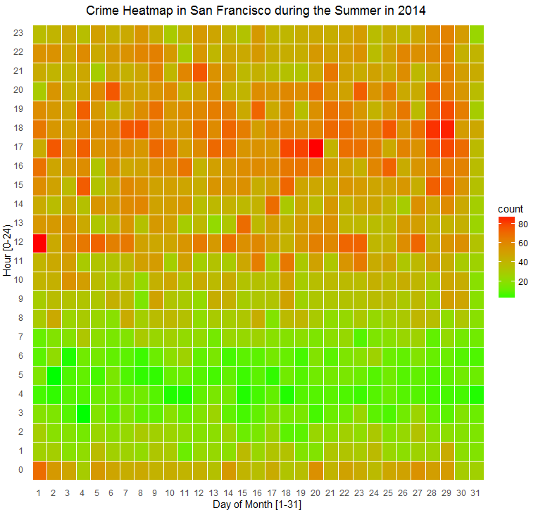
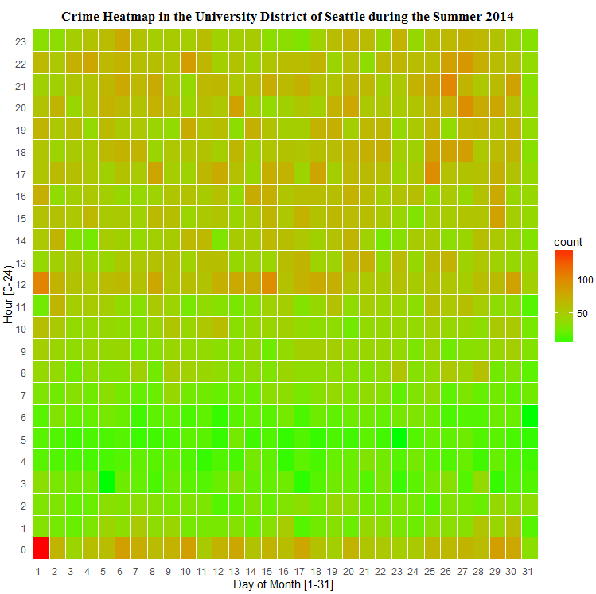
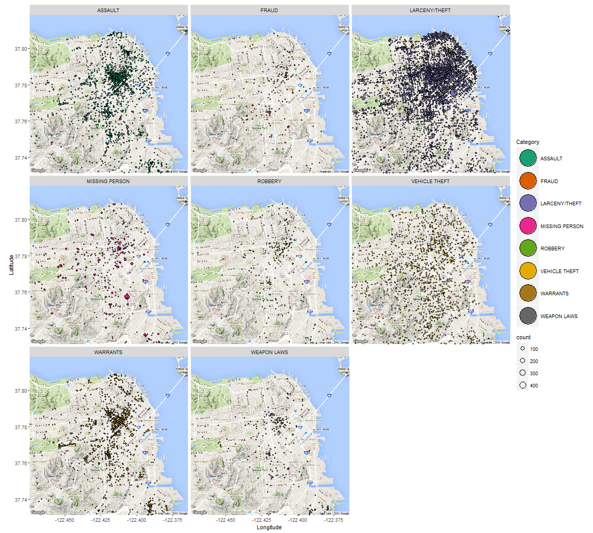
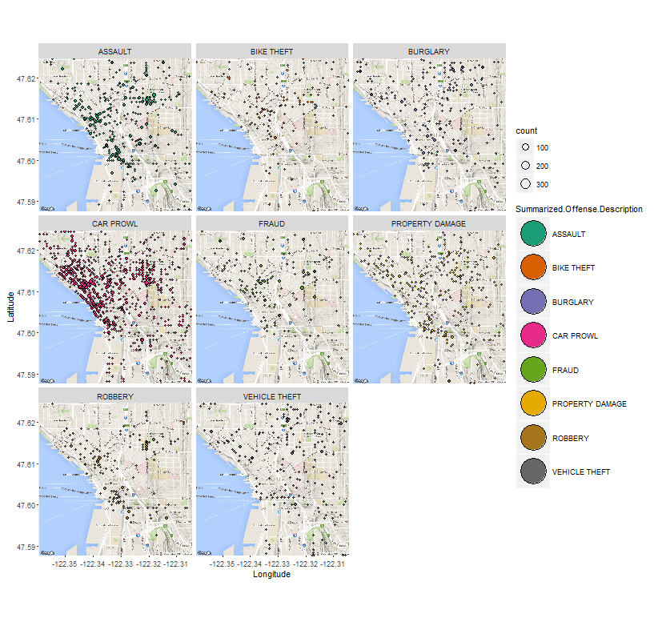
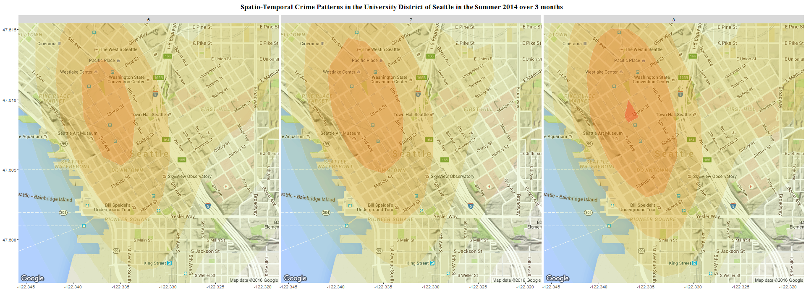
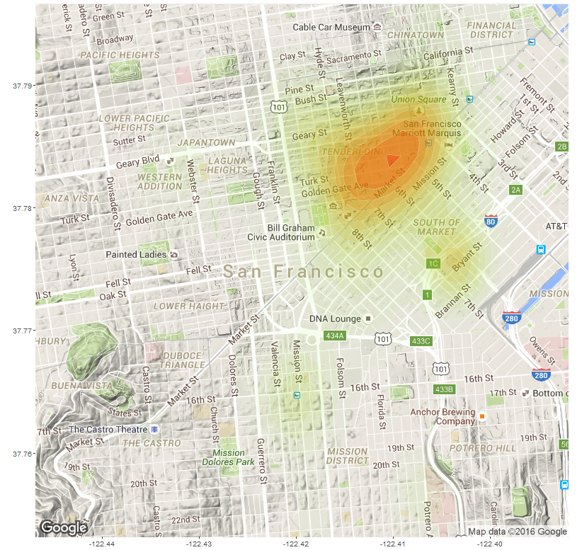
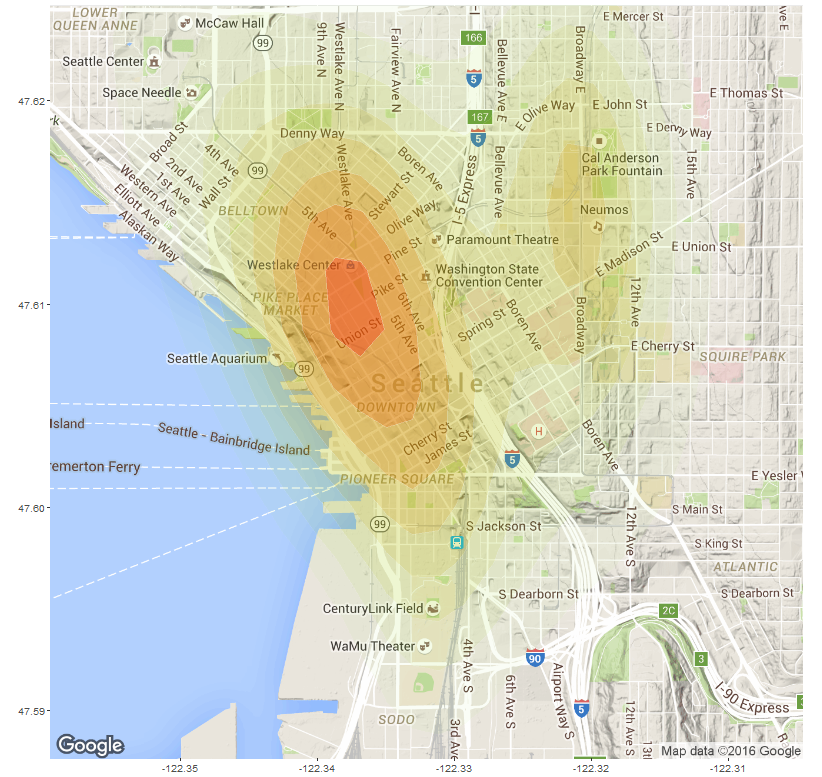

Crime Analytics: Visualization of Crime Incident Reports for Summar 2014 in San Francisco and Seattle 
=====================================================================================================

1. In this assignment, some *expoloratory analysis* is done on the **criminal incident data** from **Seattle** and 
   **San Francisco** to visualize patterns and contrast and compare patterns across the two 
   cities.
   
2. **Data** used: The real crime dataset from **Summer (June-Aug) 2014** for both of two US cities *Seattle* and 
   *San Francisco* has been used for the analysis. These reduced datasets are available on the github repository:
   https://github.com/uwescience/datasci_course_materials/tree/master/assignment6.
   
3. Each figure (supporting the analysis) has one / few of the descriptions / takeaways / insights on top of it (as header),    although the purpose of each analysis is self-explanatory.

4. Please Zoom (Ctrl+ in a browser) if required, to view the figures (e.g., read the axis labels) properly. 

5. All of the analysis / visualization was done using R and with the library graphic grammar plot and should be easily 
   reproducible.

```{r, echo=FALSE, message=FALSE, warning=FALSE}
setwd('C:/courses/Coursera/Current/Communicating Data Science Results/Week1')
#library(markdown)
#markdownToHTML('crimeanalytics.md', 'crimeanalytics.html')
library(ggplot2)
library(dplyr)
#library(wesanderson)
library(ggmap)
library(reshape)
library(GGally)
df <- read.csv('sanfrancisco_incidents_summer_2014.csv')
df$Month <- as.integer(substring(df$Date, 1, 2))
df$Day <- as.integer(substring(df$Date, 4, 5))
df$Year <- as.integer(substring(df$Date, 7, 10))
df$Hr <- as.integer(substring(df$Time, 1, 2))
df$Min <- as.integer(substring(df$Time, 4, 5))
df <- df[c('Category', 'DayOfWeek', 'Month', 'Day', 'Hr', 'PdDistrict', 'Resolution')]
df2 <- read.csv('seattle_incidents_summer_2014.csv')
df2$Day <- as.integer(substring(df2$Occurred.Date.or.Date.Range.Start, 4, 5))
df2$Hr <- as.integer(substring(df2$Occurred.Date.or.Date.Range.Start, 12, 13)) + ifelse(substring(df2$Occurred.Date.or.Date.Range.Start, 21, 22) == 'PM', 12, 0)
df2$Hr <- ifelse(df2$Hr %% 12 == 0, df2$Hr - 12,  df2$Hr)
df2 <- df2[c('Offense.Type', 'Summarized.Offense.Description', 'Day', 'Month', 'Hr', 'District.Sector', 'Longitude', 'Latitude')]
#palette(rainbow(12))
```

### Crime of Category LARCENY/THEFT is most common in San Francisco, whereas CAR PROWL is most common crime in the University District of Seattle, during the Summer Months (as can be seen from the following figures).
```{r fig.width=10, fig.height=10, echo=FALSE, message=FALSE, warning=FALSE}
ggplot(df, aes(x=reorder(Category, Category, function(x)-length(x)))) + geom_bar() +
    xlab('Crimes during Summer Months in San Francisco') +
    ylab('Number of incidents') +
    theme(axis.text.x = element_text(angle = 90, hjust = 1), legend.position="none", text = element_text(size = 15)) 
```

```{r fig.width=10, fig.height=10, echo=FALSE, message=FALSE, warning=FALSE}
ggplot(df2, aes(x=reorder(Summarized.Offense.Description, Summarized.Offense.Description, function(x)-length(x)))) + geom_bar() +
    xlab('Crimes during Summer Months in the University District of Seattle') +
    ylab('Number of incidents') +
    theme(axis.text.x = element_text(angle = 90, hjust = 1), legend.position="none", text = element_text(size = 15)) 
```

### Violent Crimes such as ROBBERY, WEAPON LAWS Increase at Night, whereas Crimes such as FRAUD, KIDNAPPING are quite common in the day time too, during Summer Months in San Francisco (as can be seen from the following figure).
```{r fig.width=25, fig.height=20, echo=FALSE, message=FALSE, warning=FALSE}
ggplot(df, aes(Hr, fill=Category)) + geom_bar() +
    #scale_x_continuous(breaks=seq(0, 24, 5)) +
    facet_wrap(~Category, scale='free') +
    xlab('Hour [0-24)') +
    ylab('Number of incidents') +
    theme(axis.text.x = element_text(angle = 90, hjust = 1), legend.position="none", 
          text = element_text(size = 15)) 
```

### Crimes such as CAR PROWL, BIKE THEFT Increase at Night, Crimes such as CAR PROWL, BIKE THEFT whereas Crimes such as FRAUD, SHOP LIFTING, STOLEN PROPERTY are quite common in the day time too, during Summer Months in the University District of Seattle (as can be seen from the following figure).
```{r fig.width=25, fig.height=20, echo=FALSE, message=FALSE, warning=FALSE}
ggplot(df2, aes(Hr, fill=Summarized.Offense.Description)) + geom_bar() +
    #scale_x_continuous(breaks=seq(0, 24, 5)) +
    facet_wrap(~Summarized.Offense.Description, scale='free') +
    xlab('Hour [0-24)') +
    ylab('Number of incidents') +
    theme(axis.text.x = element_text(angle = 90, hjust = 1), legend.position="none", 
          text = element_text(size = 15)) 

```

### The maximum number of crime incidents happened at 6 PM in the evening in San Francisco whereas the maximum number of crime incidents happened at 12 AM at night in the University District of Seattle,  during the Summer Months (as can be seen from the following figures). (Here 12 AM denotes the time in between 12:00-12:59 AM inclusive, whereas 6PM indicates the time 6:00-6:59PM inclusive.)
```{r fig.width=10, fig.height=10, echo=FALSE, message=FALSE, warning=FALSE}
ggplot(df, aes(x=reorder(Hr, Hr, function(x)-length(x)))) + geom_bar() +
    xlab('Hour [0-24)') +
    ylab('Number of incidents') +
    ggtitle('Crimes during Summer Months in San Francisco') +
    theme(axis.text.x = element_text(angle = 90, hjust = 1), legend.position="none", text = element_text(size = 15)) 
```
```{r fig.width=10, fig.height=10, echo=FALSE, message=FALSE, warning=FALSE}
ggplot(df2, aes(x=reorder(Hr, Hr, function(x)-length(x)))) + geom_bar() +
    xlab('Hour [0-24)') +
    ylab('Number of incidents') +
    ggtitle('Crimes during Summer Months in the University District of Seattle') +
    theme(axis.text.x = element_text(angle = 90, hjust = 1), legend.position="none", text = element_text(size = 15)) 
```

### The median hour when LARCENY/THEFT incidents happened was 4 PM in San Francisco whereas the median hour when BIKE THEFT incidents happened was 5 PM in the University District of Seattle,  during the Summer Months. The median hour when BURGLARY incidents happened was around 6 AM in San Francisco and was 2 PM in the University District of Seattle,  during the Summer Months (as can be seen from the following figures).
```{r fig.width=10, fig.height=10, echo=FALSE, message=FALSE, warning=FALSE}
ggplot(df, aes(Category, Hr)) + geom_boxplot() +
    xlab('Crimes during Summer Months in San Francisco') +
    ylab('Hour [0-24)') +
    scale_y_continuous(breaks=seq(0, 24, 2)) +
    theme(axis.text.x = element_text(angle = 90, hjust = 1), legend.position="none", text = element_text(size = 15)) 
```
```{r fig.width=10, fig.height=10, echo=FALSE, message=FALSE, warning=FALSE}
ggplot(df2, aes(Summarized.Offense.Description, Hr)) + geom_boxplot() +
    xlab('Crimes during Summer Months in the University District of Seattle') +
    ylab('Hour [0-24)') +
    scale_y_continuous(breaks=seq(0, 24, 2)) +
    theme(axis.text.x = element_text(angle = 90, hjust = 1), legend.position="none", text = element_text(size = 15)) 
```

### The Crimes ROBBERY and KIDKNAPPING are most common in the INGLESIDE area, whereas the Crimes MISSING PERSON, SUICIDE, RUNAWAY, FRAUD are  most common in MISSION area and the Crimes LARCENY/THEFT and LIQUOR LAWS are most common in the SOUTHERN area, during Summer Months in San Francisco (as can be seen from the following figure).
```{r fig.width=25, fig.height=20, echo=FALSE, message=FALSE, warning=FALSE}
ggplot(df, aes(x=reorder(PdDistrict, PdDistrict, function(x)-length(x)), fill=Category)) + geom_bar() +
    #scale_x_continuous(breaks=seq(0, 24, 5)) +
    facet_wrap(~Category, scale='free') +
    xlab('Crimes during Summer Months in San Francisco') +
    ylab('Number of incidents') +
    theme(axis.text.x = element_text(angle = 90, hjust = 1), legend.position="none", 
          text = element_text(size = 15)) 
```

### The Crimes ROBBERY, NARCOTICS and ILLEGAL DUMPING are most common in the K distrcit sector, whereas the Crimes CAR PROWL, SHOP LIFTING, PICKPOCKET, THEFT OF SERVICES are  most common in the M district sector and the Crime BURGLARY is most common in the B district sector, during Summer Months in the University District of Seattle (as can be seen from the following figure).
```{r fig.width=25, fig.height=20, echo=FALSE, message=FALSE, warning=FALSE}
ggplot(df2, aes(x=reorder(District.Sector, District.Sector, function(x)-length(x)), fill=Summarized.Offense.Description)) + geom_bar() +
    #scale_x_continuous(breaks=seq(0, 24, 5)) +
    facet_wrap(~Summarized.Offense.Description, scale='free') +
    xlab('Crimes during Summer Months in the University District of Seattle') +
    ylab('Number of incidents') +
    theme(axis.text.x = element_text(angle = 90, hjust = 1), legend.position="none", 
          text = element_text(size = 15)) 

```

### The maximum number of crime incidents happened at SOUTHERN area in San Francisco whereas the maximum number of crime incidents happened at the M district sector in the University District of Seattle,  during the Summer Months (as can be seen from the following figures).
```{r fig.width=10, fig.height=10, echo=FALSE, message=FALSE, warning=FALSE}
ggplot(df, aes(x=reorder(PdDistrict, PdDistrict, function(x)-length(x)))) + geom_bar() +
    xlab('Crimes during Summer Months in San Francisco') +
    ylab('Number of incidents') +
    theme(axis.text.x = element_text(angle = 90, hjust = 1), legend.position="none", text = element_text(size = 15)) 
```
```{r fig.width=10, fig.height=10, echo=FALSE, message=FALSE, warning=FALSE}
ggplot(df2, aes(x=reorder(District.Sector, District.Sector, function(x)-length(x)))) + geom_bar() +
    xlab('Crimes during Summer Months in the University District of Seattle') +
    ylab('Number of incidents') +
    theme(axis.text.x = element_text(angle = 90, hjust = 1), legend.position="none", text = element_text(size = 15)) 
```

### The Crime LARCENY/THEFT is the most common in all the areas, VEHICLE THEFT is very common in the INGLESIDE area, whereas ASSAULT is common in BAYVIEW area, during Summer Months in San Francisco (as can be seen from the following figure).
```{r fig.width=25, fig.height=20, echo=FALSE, message=FALSE, warning=FALSE}
ggplot(df, aes(x=reorder(Category, Category, function(x)-length(x)), fill=PdDistrict)) + geom_bar() +
    #scale_x_continuous(breaks=seq(0, 24, 5)) +
    facet_wrap(~PdDistrict, scale='free') +
    xlab('Crimes during Summer Months in San Francisco') +
    ylab('Number of incidents') +
    theme(axis.text.x = element_text(angle = 90, hjust = 1), legend.position="none", 
          text = element_text(size = 15)) 
```


### The Crime CAR PROWL is the most common in all the district sectors, ASSAULT is very common in the K district sector, during Summer Months in the University District of Seattle (as can be seen from the following figure).
```{r fig.width=25, fig.height=20, echo=FALSE, message=FALSE, warning=FALSE}
ggplot(df2, aes(x=reorder(Summarized.Offense.Description, Summarized.Offense.Description, function(x)-length(x)), fill=District.Sector)) + geom_bar() +
    #scale_x_continuous(breaks=seq(0, 24, 5)) +
    facet_wrap(~District.Sector, scale='free') +
    xlab('Crimes during Summer Months in the University District of Seattle') +
    ylab('Number of incidents') +
    theme(axis.text.x = element_text(angle = 90, hjust = 1), legend.position="none", 
          text = element_text(size = 15)) 

```

### Some Crimes (e.g., LIQUOR LAWS, PROSTITUTION) happened more on the Fridays, BRUGLARY happened mostly on Wednesday, during Summer Months in San Francisco (as can be seen from the following figure).
```{r fig.width=25, fig.height=25, echo=FALSE, message=FALSE, warning=FALSE}
ggplot(df, aes(DayOfWeek, fill=Category)) + geom_bar() +
  #scale_x_continuous(breaks=seq(0, 24, 5)) +
  facet_wrap(~Category, scale='free') +
  xlab('Day of Week') +
  ylab('Number of incidents') +
  ggtitle('Crimes during Summer Months in San Francisco') +
  theme(axis.text.x = element_text(angle = 90, hjust = 1), legend.position="none", 
        text = element_text(size = 15)) 

```

### Some Crimes (e.g., LOITERING, BRIBERY, BURGLARY) happened more on the beginning and the end of the months, whereas some of the crimes (ASSAULT, VEHICLE THEFT) are mostly uniform across all the days of a month, as found from the data during Summer Months in San Francisco (as can be seen from the following figure).
```{r fig.width=25, fig.height=25, echo=FALSE, message=FALSE, warning=FALSE}
ggplot(df, aes(Day, fill=Category)) + geom_bar() +
  #scale_x_continuous(breaks=seq(0, 24, 5)) +
  facet_wrap(~Category, scale='free') +
  xlab('Day of Month [1-30]') +
  ylab('Number of incidents') +
  ggtitle('Crimes during Summer Months in San Francisco') +
  theme(axis.text.x = element_text(angle = 90, hjust = 1), legend.position="none", 
        text = element_text(size = 15)) 
```

### Some Crimes (e.g., FIREWORK, HOMICIDE) happened more on the beginning and the end of the months, whereas some of the crimes (ASSAULT, BURGLARY, CAR PROWL) are mostly uniform across all the days of a month, as found from the data during Summer Months in the University District of Seattle (as can be seen from the following figure).
```{r fig.width=25, fig.height=25, echo=FALSE, message=FALSE, warning=FALSE}
ggplot(df2, aes(Day, fill=Summarized.Offense.Description)) + geom_bar() +
  #scale_x_continuous(breaks=seq(0, 24, 5)) +
  facet_wrap(~Summarized.Offense.Description, scale='free') +
  xlab('Day of Month [1-30]') +
  ylab('Number of incidents') +
  ggtitle('Crimes during Summer Months in the University District of Seattle') +
  theme(axis.text.x = element_text(angle = 90, hjust = 1), legend.position="none", 
        text = element_text(size = 15)) 
```

### The Crimes LARCENY/THEFT, FRAUD, SUICIDE, STOLEN PROPERTY, LIQUOR LAWS increase, whereas the crimes VEHICLE THEFT, MISSING PERSON decrease across all the three Summer Months (6:Jun, 7:July, 8:Aug) in San Francisco (as can be seen from the following figure).
```{r fig.width=20, fig.height=20, echo=FALSE, message=FALSE, warning=FALSE}
df1 <- df %>% group_by(Category, Month) %>% summarise(count=n()) 
ggplot(df1, aes(Month, count)) + geom_point(size=3) + geom_line(aes(colour=Category), size=1.2) +
    scale_x_continuous(breaks=seq(6, 8, 1)) +
    facet_wrap(~Category, scale='free') +
    ylab('Number of incidents') +
    ggtitle('Crimes during Summer Months in San Francisco') +
    theme(axis.text.x = element_text(angle = 90, hjust = 1), legend.position="none", 
          text = element_text(size = 15)) 
```

### The Crimes BIKE THEFT, THEFT OF SERVICES, INJURY increase, whereas the crimes VEHICLE THEFT, NARCOTICS decrease across all the three Summer Months (6:Jun, 7:July, 8:Aug) in the University District of Seattle.
```{r fig.width=20, fig.height=20, echo=FALSE, message=FALSE, warning=FALSE}
df1 <- df2 %>% group_by(Summarized.Offense.Description, Month) %>% summarise(count=n()) 
ggplot(df1, aes(Month, count)) + geom_point(size=3) + geom_line(aes(colour=Summarized.Offense.Description), size=1.2) +
    scale_x_continuous(breaks=seq(6, 8, 1)) +
    facet_wrap(~Summarized.Offense.Description, scale='free') +
    ylab('Number of incidents') +
    ggtitle('Crimes during Summer Months in the University District of Seattle') +
    theme(axis.text.x = element_text(angle = 90, hjust = 1), legend.position="none", 
          text = element_text(size = 15)) 
```


### The Crime LARCENY/THEFT is the most common in all the three Summer Months (6:Jun, 7:July, 8:Aug) in San Francisco. The Crime CAR PROWl is the most common during all the three Summer Months (6:Jun, 7:July, 8:Aug) in the University District of Seattle (as can be seen from the following figures).
```{r fig.width=20, fig.height=10, echo=FALSE, message=FALSE, warning=FALSE}
ggplot(df, aes(x=reorder(Category, Category, function(x)-length(x)), fill=Category)) + geom_bar() +
    #scale_x_continuous(breaks=seq(0, 24, 5)) +
    facet_wrap(~Month, scale='free') +
    xlab('Crimes during Summer Months in San Francisco') +
    ylab('Number of incidents') +
    theme(axis.text.x = element_text(angle = 90, hjust = 1), legend.position="none", 
          text = element_text(size = 15)) 
```

```{r fig.width=20, fig.height=10, echo=FALSE, message=FALSE, warning=FALSE}
ggplot(df2, aes(x=reorder(Summarized.Offense.Description, Summarized.Offense.Description, function(x)-length(x)), fill=Summarized.Offense.Description)) + geom_bar() +
    #scale_x_continuous(breaks=seq(0, 24, 5)) +
    facet_wrap(~Month, scale='free') +
    xlab('Crimes during Summer Months in the University District of Seattle') +
    ylab('Number of incidents') +
    theme(axis.text.x = element_text(angle = 90, hjust = 1), legend.position="none", 
          text = element_text(size = 15)) 

```

### The highest number of crime incidents happend in the month of August in San Francisco, whereas the highest number of crime incidents happend in the month of July in the University District of Seattle during the Summer Months 2014 (as can be seen from the following figures).
```{r fig.width=5, fig.height=5, echo=FALSE, message=FALSE, warning=FALSE}
ggplot(df, aes(x=reorder(Month, Month, function(x)-length(x)))) + geom_bar() +
    xlab('Month (Jun-Aug)') +
    ylab('Number of incidents') +
    ggtitle('Crimes during Summer Months in San Francisco') +
    theme(axis.text.x = element_text(angle = 90, hjust = 1), legend.position="none", text = element_text(size = 10)) 
```

```{r fig.width=5, fig.height=5, echo=FALSE, message=FALSE, warning=FALSE}
ggplot(df2, aes(x=reorder(Month, Month, function(x)-length(x)))) + geom_bar() +
    xlab('Month (Jun-Aug)') +
    ylab('Number of incidents') +
    ggtitle('Crimes during Summer Months in the University District of Seattle') +
    theme(axis.text.x = element_text(angle = 90, hjust = 1), legend.position="none", text = element_text(size = 10)) 
```

### The highest number of crime incidents happend on Friday in San Francisco, during the Summer Months (as can be seen from the following figure).
```{r fig.width=5, fig.height=5, echo=FALSE, message=FALSE, warning=FALSE}
ggplot(df, aes(x=reorder(DayOfWeek, DayOfWeek, function(x)-length(x)))) + geom_bar() +
    xlab('Day Of Week') +
    ylab('Number of incidents') +
    ggtitle('Crimes during Summer Months in San Francisco') +
    theme(axis.text.x = element_text(angle = 90, hjust = 1), legend.position="none", text = element_text(size = 10)) 
```

### The highest number of crime incidents happend on the 29th of a month in San Francisco, whereas the highest number of crime incidents happend on the 25th of a month in the University District of Seattle during the Summer Months (as can be seen from the following figures).
```{r fig.width=10, fig.height=10, echo=FALSE, message=FALSE, warning=FALSE}
ggplot(df, aes(x=reorder(Day, Day, function(x)-length(x)))) + geom_bar() +
    xlab('Day in Month') +
    ylab('Number of incidents') +
    ggtitle('Crimes during Summer Months in San Francisco') +
    theme(axis.text.x = element_text(angle = 90, hjust = 1), legend.position="none", text = element_text(size = 15)) 
```

```{r fig.width=10, fig.height=10, echo=FALSE, message=FALSE, warning=FALSE}
ggplot(df2, aes(x=reorder(Day, Day, function(x)-length(x)))) + geom_bar() +
    xlab('Day in Month') +
    ylab('Number of incidents') +
    ggtitle('Crimes during Summer Months in the University District of Seattle') +
    theme(axis.text.x = element_text(angle = 90, hjust = 1), legend.position="none", text = element_text(size = 15)) 
```

### The crime incident types MISSING PERSON and DRUNKENNESS tend to correlate with each other on a day-by-day basis (with a quite high correlation coefficient of 0.729) in San Francisco during the summer months. (The following figure also shows the day-to-day distribution of the number crime incidents as densities). **Please Zoom (Ctrl + in browser) to view the following correlation plot properly**.
```{r fig.width=35, fig.height=35, echo=FALSE, message=FALSE, warning=FALSE, error=FALSE}
df1 <- df %>% group_by(Category, Day) %>% summarise(count=n()) 
df1<-cast(df1, Day~Category)[-1]
names(df1) <- gsub(' ', '_', names(df1))
names(df1) <- gsub('/', '_', names(df1))
names(df1) <- gsub('-', '_', names(df1))
#png('cor2.png', width = 1000, height = 1000)
ggpairs(df1[c(2,6,7,8,13,15,16,19,20,21,23,24,26,29,30,32,33,34)],
      lower = list(continuous = "smooth"))  +   
      theme(legend.position = "none",
        panel.grid.major = element_blank(),
        axis.ticks = element_blank(),
        axis.text.x = element_text(angle = 90, hjust = 1), 
        axis.text.y = element_text(angle = 90, hjust = 1), 
        axis.title.x = element_text(angle = 180, vjust = 1, color = "black"), text = element_text(size = 10),
        panel.border = element_rect(fill = NA))
#dev.off()
```

### The crime incident type BIKE THEFT tends to correlate well with VEHICLE THEFT and TRAFFIC on a day-by-day basis (with a moderately high correlation coefficient of ~0.5) in the University District of Seattle during the summer months during the summer months. (The following figure also shows the day-to-day distribution of the number crime incidents as densities). **Please Zoom (Ctrl + in browser) to view the following correlation plot properly**.
```{r fig.width=35, fig.height=35, echo=FALSE, message=FALSE, warning=FALSE, error=FALSE}
df1 <- df2 %>% group_by(Summarized.Offense.Description, Day) %>% summarise(count=n()) 
df1<-cast(df1, Day~Summarized.Offense.Description)[-1]
names(df1) <- gsub(' ', '_', names(df1))
names(df1) <- gsub('/', '_', names(df1))
names(df1) <- gsub('-', '_', names(df1))
#png('cor2.png', width = 1500, height = 1500)
ggpairs(df1[c(3,5,6,8,9,19,20,
              25,38,39,41,42,43,45)],
        lower = list(continuous = "smooth"))  +   
        theme(legend.position = "none",
        panel.grid.major = element_blank(),
        axis.ticks = element_blank(),
        axis.text.x = element_text(angle = 90, hjust = 1), 
        axis.text.y = element_text(angle = 90, hjust = 1), 
        axis.title.x = element_text(angle = 180, vjust = 1, color = "black"), text = element_text(size = 10),
        panel.border = element_rect(fill = NA))
#dev.off()
```

### The following visualizations show how the number of incidents vary over day and hours overall and also for a few different types of crimes and areas in San Francisco during the summer months. As can be seen, the maximum number of crimes occured in between 3 PM - 8 PM in the evening, whereas the minimum number of crimes occured at around 5 AM in the morning.  
```{r echo=FALSE, message=FALSE, warning=FALSE, error=FALSE}
df1 <- df %>% group_by(Day) %>% summarise(numIncidents=n())
ggplot(df1, aes(x=Day, y=numIncidents)) + geom_point() + stat_smooth() +
   xlab('Day') +
   ylab('Number of daily incidents') +
   ggtitle('Crimes during Summer Months in San Francisco')


df1 <- df %>% group_by(Hr) %>% summarise(numIncidents=n())
ggplot(df1, aes(x=Hr, y=numIncidents)) + geom_point() + stat_smooth() +
   xlab('Hour [0-24)') +
   ylab('Number of hourly incidents') +
   ggtitle('Crimes during Summer Months in San Francisco')


df1 <- df %>% group_by(Category, Day) %>% summarise(numIncidents=n())
ggplot(df1, aes(x=Category, y=numIncidents)) + geom_boxplot() +
 xlab('Crime Category') +
 ylab('Number of daily incidents')  +
 ggtitle('Crimes during Summer Months in San Francisco') +
 theme(axis.text.x = element_text(angle = 90, hjust = 1), legend.position="none", text = element_text(size = 15)) 

df1 <- df %>% group_by(Category, Hr) %>% summarise(numIncidents=n())
ggplot(df1, aes(x=Category, y=numIncidents)) + geom_boxplot() +
 xlab('Crime Category') +
 ylab('Number of hourly incidents')  +
 ggtitle('Crimes during Summer Months in San Francisco') +
 theme(axis.text.x = element_text(angle = 90, hjust = 1), legend.position="none", text = element_text(size = 15)) 

df1 <- df %>% group_by(PdDistrict, Hr) %>% summarise(numIncidents=n())
ggplot(df1, aes(x=PdDistrict, y=numIncidents)) + geom_boxplot() +
  xlab('Area') +
  ylab('Number of hourly crime incidents')  +
  ggtitle('Crimes during Summer Months in San Francisco') +
  theme(axis.text.x = element_text(angle = 90, hjust = 1), legend.position="none", text = element_text(size = 15)) 

df1 <- df %>% group_by(PdDistrict, Day) %>% summarise(numIncidents=n())
ggplot(df1, aes(x=PdDistrict, y=numIncidents)) + geom_boxplot() +
  xlab('Area') +
  ylab('Number of daily crime incidents') +
   ggtitle('Crimes during Summer Months in San Francisco') +
  theme(axis.text.x = element_text(angle = 90, hjust = 1), legend.position="none", text = element_text(size = 15)) 

```

```{r fig.width=25, fig.height=25, echo=FALSE, message=FALSE, warning=FALSE, error=FALSE}
df1 <- df %>% group_by(Day, Hr, Category) %>% summarise(numIncidents=n())
ggplot(df1, aes(Day, Hr)) + stat_binhex(binwidth = c(5, 3)) +facet_wrap(~Category) +
  xlab('Day') +
  ylab('Hour [0-24)') +
  ggtitle('Density of Crimes during Summer Months in San Francisco at different hours in a day') +
  theme(axis.text.x = element_text(angle = 90, hjust = 1), text = element_text(size = 20)) 
```

### As can be seen from the next visualization, most of the crimes (more than \(60\%\)) in San Francisco, there were no resolution, whereas just over \(20\%\) of the cases there were arrests.
```{r fig.width=25, fig.height=30, echo=FALSE, message=FALSE, warning=FALSE, error=FALSE}
ggplot(df, aes(x=reorder(Resolution, Resolution, function(x)-length(x)))) + 
   geom_bar(aes(y = 100 *(..count..)/sum(..count..))) +
   xlab('Resolution') +
   ylab('Percentage of all crime incidents') +
   ggtitle('Crimes during Summer Months in San Francisco') +
   theme(axis.text.x = element_text(angle = 90, hjust = 1), legend.position="none", text = element_text(size = 20)) 
```

### As can be seen from the next visualization, the highest number of arrest, booked resolution in San Francisco was for crime category WARRANT.
```{r fig.width=25, fig.height=30, echo=FALSE, message=FALSE, warning=FALSE, error=FALSE}
ggplot(df, aes(reorder(Category, Category, function(x)-length(x)), fill=Resolution)) + geom_bar() +
  #scale_x_continuous(breaks=seq(0, 24, 5)) +
  facet_wrap(~Resolution, scale='free') +
  xlab('Crime Categories') +
  ylab('Number of incidents') +
  ggtitle('Crimes during Summer Months in San Francisco') +
  theme(axis.text.x = element_text(angle = 90, hjust = 1), legend.position="none", 
        text = element_text(size = 20)) 
```

### As can be seen from the next visualization, most of the resolutions (such as arrest booked/cited) in San Francisco belong to SOUTHERN area (where most of the crimes happened, as seen earlier), but the highest number of unresolved cases belong to the same area as well. The higest number of JUVENILE BOOED resolution taken was in BAYVIEW, where the maximum number of EXCEPTIONAL CLEARANCE resolution was for TARVAL.
```{r fig.width=25, fig.height=25, echo=FALSE, message=FALSE, warning=FALSE, error=FALSE}
ggplot(df, aes(reorder(PdDistrict, PdDistrict, function(x)-length(x)), fill=Resolution)) + geom_bar() +
  #scale_x_continuous(breaks=seq(0, 24, 5)) +
  facet_wrap(~Resolution, scale='free') +
  xlab('Area') +
  ylab('Number of incidents') +
  ggtitle('Crimes during Summer Months in San Francisco') +
  theme(axis.text.x = element_text(angle = 90, hjust = 1), legend.position="none", 
        text = element_text(size = 20)) 
```

### The following (Heatmap) visualization shows that (w.r.t. the total number of incidents count) 3 AM - 7 AM is the safest time in San Francisco during the summer months.


### The following (Heatmap) visualization shows that (w.r.t. the total number of incidents) 1 AM - 11 AM is the safest time in the University District of Seattle during the summer months.


### The following visualization shows the spatial patterns (w.r.t. the total number of incidents) for a few different types of crimes in San Francisco during the summer months.


### The following visualization shows the spatial patterns (w.r.t. the total number of incidents) for a few different types of crimes in the University District of Seattle during the summer months.


### The following visualization shows how the crime patrerns changed over months in the University District of Seattle during the summer months.


### The following visualization (Contour) shows that the most of the crimes happened in the region Tenderloin and Market St (w.r.t. the total number of incidents) in San Francisco during the summer months.


### The following visualization (Contour) shows that the most of the crimes happened in the region WesteLake Center, Union Street and PIKEPLACE Market (w.r.t. the total number of incidents) in the University District of Seattle during the summer months.



```{r fig.width=30, fig.height=30, echo=FALSE, message=FALSE, warning=FALSE, error=FALSE}
#df1 <- df2 %>% group_by(Latitude, Longitude, Summarized.Offense.Description) %>% summarise(count=n()) 
#seattle <- geocode("SEATTLE")
#map.seattle_city <- get_map(location = c(lon = seattle$lon, lat = seattle$lat), source='google', zoom=14) #qmap(, zoom = 11, source="google")
#map.seattle_city
#df1 <- df1 %>% filter(Summarized.Offense.Description %in% c('ASSAULT', 'BIKE THEFT', 'BURGLARY', 'CAR PROWL', 'FRAUD',  #'ROBBERY', 'STOLEN PROPETY', 'VEHICLE THEFT', 'PROPERTY DAMAGE'))
#colourCount = 12
#getPalette = colorRampPalette(brewer.pal(9, "Set1"))
#ggmap(map.seattle_city) + 
#  facet_wrap(~Summarized.Offense.Description) +
#  geom_point(aes(x=Longitude, y=Latitude, fill=Summarized.Offense.Description, size=count), colour="black", shape=21, data#=df1) + 
  #scale_colour_manual(values=c("dark blue","orange"))+
  #labs(fill="Summarized.Offense.Description") +
#  xlab('Longitude') +
#  ylab('Latitude') +
#  scale_fill_brewer(palette="Dark2") + guides(fill = guide_legend(override.aes = list(size=15)))
  #scale_color_manual(values=wes_palette(n=8, name="GrandBudapest"))
  #scale_colour_hue(l=80, c=150)
  #scale_shape_manual(values = 1:48) 

#ggmap(map.seattle_city) + 
#facet_wrap(~Summarized.Offense.Description) +
#geom_point(aes(x=Longitude, y=Latitude, fill=Summarized.Offense.Description, size=count), colour="black", shape=21, #data=df1) +
#  scale_fill_brewer(palette="Dark2") + guides(fill = guide_legend(override.aes = list(size=15)))

#ggmap(houston.map, extent = "normal", maprange=FALSE) %+% W + aes(x = lon, y = lat) +
#     geom_density2d() +
#     stat_density2d(aes(fill = ..level.., alpha = ..level..),
#                    size = 0.01, bins = 16, geom = 'polygon') +
#     scale_fill_gradient(low = "green", high = "red") +
#     scale_alpha(range = c(0.00, 0.25), guide = FALSE) +
#     coord_map(projection="mercator", 
#               xlim=c(attr(houston.map, "bb")$ll.lon, attr(houston.map, "bb")$ur.lon),
#               ylim=c(attr(houston.map, "bb")$ll.lat, attr(houston.map, "bb")$ur.lat)) +
#     theme(legend.position = "none", axis.title = element_blank(), text = element_text(size = 12))
```
