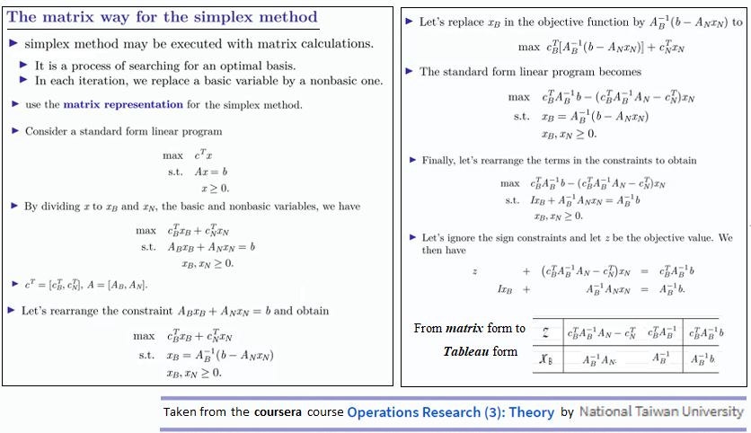
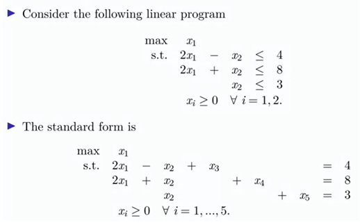
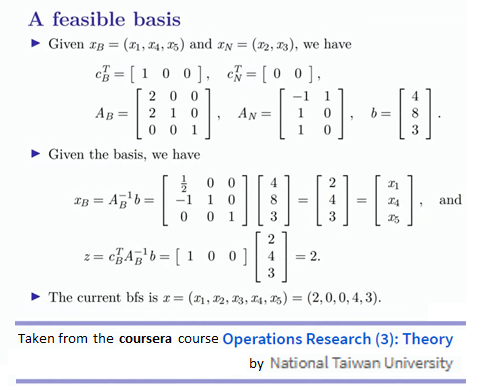
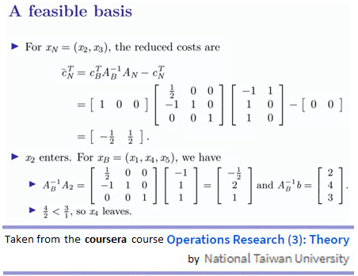
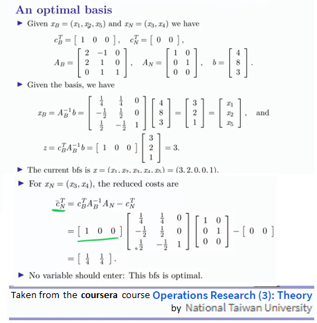
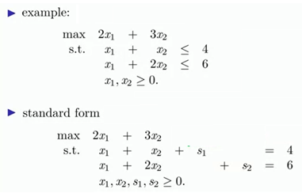
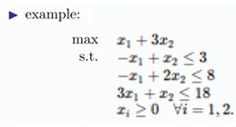

### Sandipan Dey

## Introduction

The goal of this article is to explain, implement and demonstrate how the popular **simplex** algorithm for solving a **linear program** can be revised to form a matrix-based algorithm (instead of tableau-based), so that the algorithm is known as **revised simplex** algorithm. This algorithm has been taught in the **coursera** course **Operations Research Theory** by the **National Taiwan University**. The theory part will be described as is from the course itself, along with an attempt  to implement the **matrix-based simplex method** with **R** (from scratch) and demonstrate with examples.

## Theory

Let's start with the theory part. The simplex method is a very popular algorithm to solve **constrained linear optimization** (**maximization** or **minimization**) problems. It can be thought of as optimizing a linear **objective function** of the **decision** variables, so that the (linear) constraints remain satisfied, by traveling in the direction of increase in the value of the objective function (or equivalently decrease in the value of objective, in case of a minimization problem), from one corner to the another corner of a convex polytope formed by the constraints (each corner represents a **basic feasible solution**), until the optimal solution is obtained (assuming the problem is **bounded** and **feasible**) and stopping as soon as the optimal solution is obtained.

The iterative algorithm starts with a basic feasible solution and with each iteration it improves (e.g., for a maximization problem increases) the objective function value by changing a nonbasic variable to a basic one. First the linear program needs to be converted to the standard form. At each iteration the nonbasic variable corresponding to the most negative value in the **reduced costs** (allowing the highest possible increase) **enters** the **basis**, which constitutes the **pivot** column, Now, the basic variable which is first supposed to violate a constraint **leaves** the **basis**, determined by the minimum non-negative finite value in the **ratio** test. The algorithm terminates when all values are non-negative in the **reduced costs**, since there is no further scope of increase in value for the objective function.

The next figure describes how the simplex method can be thought of in matrix way. Note that the classic **tableau** can be computed using the matrix method at any step, although it's not required.



## Implementation

The next **R** code snippet implements the above algorithm in matrix way, at every iterative step of the simplex method, the function `simplex.matrix.iter()` needs to get called. Note that we only need to consider the pivot column to determine which basic variable leaves the basis, using the ratio test and not the entier matrix.

```{r results='asis', null_prefix=TRUE, message=FALSE}

library(tidyverse)
library(knitr)
library(kableExtra)

f_i <- 1

save.image <- function(m, caption, prob) {
  m %>% kable(format='latex', caption=caption) %>% kable_styling(c("striped", "bordered"), full_width = FALSE) %>% 
  save_kable(file = paste0('out/out_', prob, '_', f_i, '.html'))
  f_i <<- f_i + 1
}

print.matrices <- function(A, b, c, X_B, X_N, A_B, A_N, c_B, c_N, x, z, r_c, opt, prob) {

  X <- 1:(ncol(A))
  dimnames(A) <- list(NULL, paste0('x', X)) #[[2]]
  save.image(A, '**A**', prob)
  save.image(b, '**b**', prob)
  c_t <- matrix(c, nrow=1)
  dimnames(c_t)[[2]] <- paste0('x', X)
  save.image(c_t, '$$c^T$$', prob)
  X_B_t <- matrix(X_B, nrow=1)
  dimnames(X_B_t)[[2]] <- paste0('x', X_B)
  save.image(X_B_t, '$$X_B$$', prob)
  X_N_t <- matrix(X_N, nrow=1)
  dimnames(X_N_t)[[2]] <- paste0('x', X_N)
  save.image(X_N_t, '$$X_N$$', prob)
  c_B_t <- matrix(c_B, nrow=1)
  dimnames(c_B_t)[[2]] <- paste0('x', X_B)
  save.image(c_B_t, '$$c_B^T$$', prob)
  c_N_t <- matrix(c_N, nrow=1)
  dimnames(c_N_t)[[2]] <- paste0('x', X_N)
  save.image(c_N_t, '$$c_N^T$$', prob)
  dimnames(A_B) <- list(NULL, paste0('x', X_B))
  dimnames(A_N) <- list(NULL, paste0('x', X_N))
  save.image(A_B, '$$A_B$$', prob)
  save.image(A_N, '$$A_N$$', prob)
  x_t <- matrix(x, nrow=1)
  dimnames(x_t)[[2]] <- paste0('x', X)
  save.image(x_t, '**x (solution)**', prob)
  save.image(z, '**z (objective value)**', prob)
  save.image(opt, '**Optimal**', prob)
  r_c <- matrix(r_c, nrow=1)
  dimnames(r_c) <- list(NULL, paste0('x', X_N))
  save.image(r_c, '**reduced cost** = $$c_B^TA_B^{-1}A_N-c_N^T$$', prob)
}

simplex.matrix.iter <- function(A, b, c, X_B, prob) {
  X <- 1:(ncol(A))
  X_N <- setdiff(X, X_B)
  A_B <- A[,X_B]
  A_N <- A[,X_N]
  c_B <- c[X_B]
  c_N <- c[X_N]
  A_B_1 <- solve(A_B)
  #A_B_1A <- A_B_1 %*% A
  A_B_1b <- solve(A_B, b)
  c_BA_B_1 <- c_B %*% A_B_1
  c_BA_B_1A_N_c_N <- c_BA_B_1%*%A_N - c_N
  x <- rep(0, ncol(A))
  x[X_B] <- A_B_1b
  z <- c_BA_B_1 %*% b
  opt <- all(c_BA_B_1A_N_c_N >= 0) #all(c(c_BB_1, c_BB_1A_c) >= 0)
  f_i <<- 1
  print.matrices(A, b, c, X_B, X_N, A_B, A_N, c_B, c_N, x, z, c_BA_B_1A_N_c_N, opt, prob)

  res <- list()
  m <- min(c_BA_B_1A_N_c_N)
  if (m < 0) {
    e_ix <- X_N[which.min(c_BA_B_1A_N_c_N)]
    A_B_1A_e <- A_B_1 %*% A[,e_ix]
    m <- Inf
    l_ix <- -1
    for (i in 1:length(A_B_1b)) {
       if ((A_B_1A_e[i] > 0) & (A_B_1b[i] / A_B_1A_e[i] < m)) {
         m <- A_B_1b[i] / A_B_1A_e[i]
         l_ix <- i
      }
    }
    if (l_ix < 0) {
      res$unbounded <- TRUE
      return(res)
    }
    save.image(data.frame(step=paste0('x', e_ix, ' enters the basis')), '', prob)
    save.image(A_B_1A_e, paste0('$$A_B^{-1}A$$', e_ix), prob)
    save.image(A_B_1b, '$$A_B^{-1}b$$', prob)
    r <- A_B_1b / A_B_1A_e
    dimnames(r) <- list(paste0('x', X_B), NULL)
    save.image(r, '**ratio**', prob)
    save.image(data.frame(step=paste0('x', X_B[l_ix], ' leaves the basis')), '', prob)
    X_B[l_ix] <- e_ix
  } else {
    res$opt <- TRUE
  }
  res$X_B <- X_B  # vars
  res$x <- x     # values
  res$z <- z    # objective
  res$opt <- opt
  res$unbounded <- FALSE
  return(res)
}
```

## Examples

Now, let's consider a few examples to demonstrate the above algorithm implementation step by step.

### Example 1



Using the above theory, here's how the simplex method works, starting from the basis $$X_B=(x_1,x_4,x_5)$$:





Now, let's obtain the same result using the implementation above:

```{r message=FALSE}
A <- matrix(c(2,2,0,-1,1,1), ncol=2) 
m <- nrow(A) 
n <- ncol(A) 
b <- matrix(c(4,8,3), ncol=1) 
c <- c(1,0)

A <- cbind(A, diag(m)) # add slack columns
c <- c(c, rep(0, m))

X_B <- c(1,4,5)
opt <- FALSE
i <- 1
while (!opt) { 
  print(data.frame(Iteration=i) %>% kable()) 
  res <- simplex.matrix.iter(A, b, c, X_B, 1) 
  X_B <- res$X_B 
  opt <- res$opt
  #print(res)
  i <- i + 1
}
```

### Example 2

This time let's start with $$X_B=(x_3,x_4)$$, i.e. the **slack variables** $$(s_1,s_2)$$ as the basic variables.



Now, lets demonstrate with our implementation with the simplex matrix method:

```{r message=FALSE}
A <- matrix(c(1,1,1,2), ncol=2) 
m <- nrow(A) 
n <- ncol(A) 
b <- matrix(c(4,6), ncol=1) 
c <- c(2,3)

A <- cbind(A, diag(m)) # add slack columns
c <- c(c, rep(0, m))

X_B <- (n+1):(n+m)
opt <- FALSE
i <- 1
while (!opt) { 
  print(data.frame(Iteration=i) %>% kable()) 
  res <- simplex.matrix.iter(A, b, c, X_B, 2) 
  X_B <- res$X_B 
  opt <- res$opt
  #print(res)
  i <- i + 1
}
```

Verify the soltion obtained with **R** package's implementation:

```{r message=FALSE}
library(lpSolve)
objective.fn <- c
const.mat <- A
const.dir <- rep("<=", nrow(A))
const.rhs <- b
lp.solution <- lp("max", objective.fn, const.mat, 
                  const.dir, const.rhs, compute.sens=TRUE)
#lp.solution$objective
print(lp.solution$solution)
print(lp.solution$objval)
```
### Example 3



Again, let's start with $$X_B=(x_3,x_4,x_5)$$, i.e. the **slack variables** as the basic variables.

```{r message=FALSE}
A <- matrix(c(-1,-1,3,1,2,1), ncol=2) 
m <- nrow(A) 
n <- ncol(A) 
b <- matrix(c(3,8,18), ncol=1) 
c <- c(1,3)

A <- cbind(A, diag(m)) # add slack columns
c <- c(c, rep(0, m))

X_B <- (n+1):(n+m)
opt <- FALSE
i <- 1
while (!opt) { 
  print(data.frame(Iteration=i) %>% kable()) 
  res <- simplex.matrix.iter(A, b, c, X_B, 3) 
  X_B <- res$X_B 
  opt <- res$opt
  #print(res)
  i <- i + 1
}
```

Let's compare the above solution obtained using the function `lp()` from **R** package `lpSolve`. Note that exactly same solution is obtained.

```{r message=FALSE}
library(lpSolve)
objective.fn <- c
const.mat <- A
const.dir <- rep("<=", nrow(A))
const.rhs <- b
lp.solution <- lp("max", objective.fn, const.mat, 
                  const.dir, const.rhs, compute.sens=TRUE)
print(lp.solution$solution)
print(lp.solution$objval)
```


### Example 4

```{r message=FALSE}
A <- matrix(c(1,2,0,0,2,1,3,0,5,1,-3,2), nrow=3) 
m <- nrow(A) 
n <- ncol(A) 
b <- matrix(c(15,18,20), ncol=1) 
c <- c(4,3,2,3) 

A <- cbind(A, diag(m)) # add slack columns
c <- c(c, rep(0, m))
X_B <- (n+1):(n+m)

opt <- FALSE
i <- 1
while (!opt) { 
  print(data.frame(Iteration=i) %>% kable()) 
  res <- simplex.matrix.iter(A, b, c, X_B, 4) 
  X_B <- res$X_B 
  opt <- res$opt
  #print(res)
  i <- i + 1
}
```

Verification with `lpSolve`:

```{r message=FALSE}
library(lpSolve)
objective.fn <- c
const.mat <- A
const.dir <- rep("<=", nrow(A))
const.rhs <- b
lp.solution <- lp("max", objective.fn, const.mat, 
                  const.dir, const.rhs, compute.sens=TRUE)
#lp.solution$objective
print(lp.solution$solution)
print(lp.solution$objval)
```