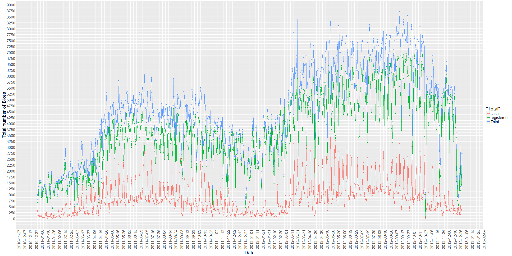
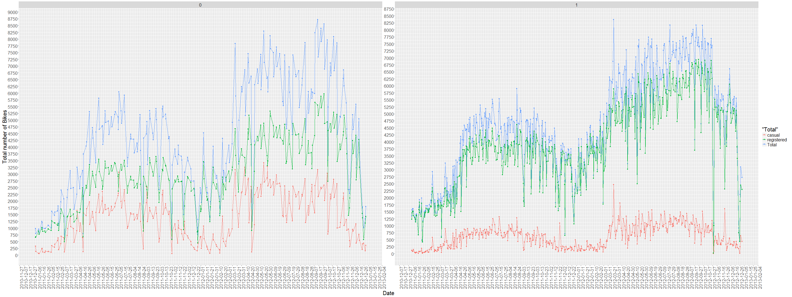
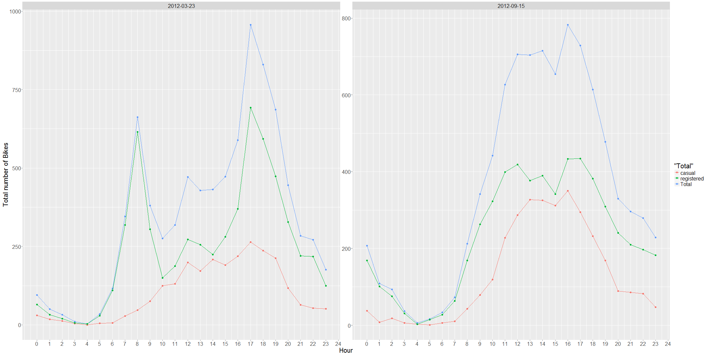

Sensing traffic mobility in the Washington D.C. area in 2011-2012 with the Bike Rental Data from the Capital Bikeshare system
=============================================================================================================================
author: Sandipan Dey
date: Feb 11, 2016

Method: The casual, registered and the overall bike rental counts were ploted as time series data.
=============================================================================================================
- From the daily bike rental count plots the peak days are identified. 
- The different patterns in the bike rental counts on the working days vs. on the non-working days are compared.
- From the working days, 2012-03-23 had the highest bike rental counts, the hourly bike rentals are plotted.
- From the non-working days, 2012-09-15 had the highest bike rental counts, the hourly bike rentals are plotted.

Overall Bike Rental Counts
========================================================

Bike Rental Counts for Working and non-working days
========================================================

Bike Rental Counts for the days with the highest bike rent counts
=================================================================

Conclusion
==========

As can be seen, the most of important events in the city can be detected via monitoring the bike rental counts. At the same time, the workingdays and non-workingdays patterns can be seen to be quite different.
